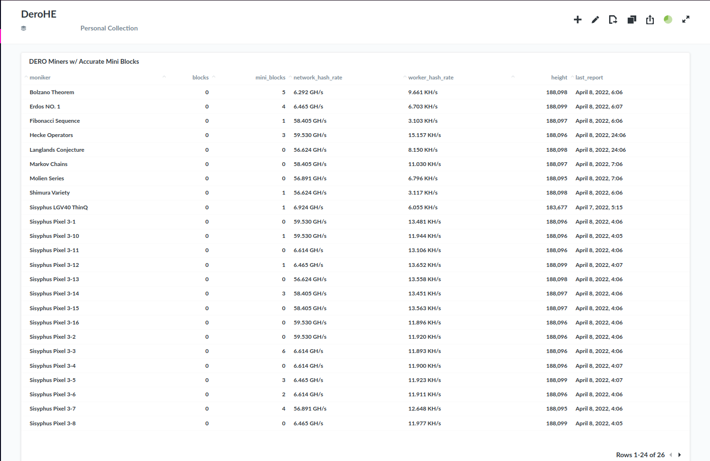

# minereader
DeroHE Miner With Constant Logging to MySQL Server

## Requirements
* MySQL 8.0+
* uswgi
* Python 3.6+
* Flask, Flask-MySQL

### Optional
* Metabase or other MySQL Visual Software

## Install
Clone:

`git clone https://github.com/MathNodes/minereader`


### Server

Edit the following lines with your MySQL set-up in the *minereader.py* file

```python
# EDIT THESE
# MySQL configurations
app.config['MYSQL_DATABASE_USER'] = 'derohe'
app.config['MYSQL_DATABASE_PASSWORD'] = 'PASSWORD'
app.config['MYSQL_DATABASE_DB'] = 'derohe'
app.config['MYSQL_DATABASE_HOST'] = 'localhost'
```


On a server set-up minereader server

```
./app_run.sh IP --port port
```


### Client

Use `dero-miner-android-mathnodes` or `dero-miner-linux-mathnodes` on your device or CPU.

**NOTE**: The only thing changed in MathNodes DeroHE miner from the DEROPROJECT is the following:

Line 288:
```go
logger.V(0).Info("", "height", strconv.FormatInt(int64(our_height),10), "blocks", strconv.FormatInt(int64(block_counter),12), "mini_blocks", strconv.FormatInt(int64(mini_block_counter),12), "hash_rate", hash_rate_string, "worker_hashrate", mining_string)
```

Line 293:
```go
time.Sleep(60 * time.Second) //changed to log every minute instead of every second (MathNodes)
```

Edit `mining.sh` or `mining-android.sh` with your Wallet Address and a DAEMON if you have one. Feel free to use our daemon if you didn't set one up: `dero.mathnodes.com:10100`

Run
```shell
./mining.sh
```

In a new terminal on the same device run the *minereader* script

```shell
./minereader-android Moniker IP:PORT
```

Where **IP:PORT** is the IP address and Port number of your minereader server.

All done. Use your MySQL set-up to check your status.


## MySQL Config

### Create DEROHE Table, User, and Permissions

Open mysql

```shell
mysql -u root -p
```

Create Table and User. Edit PASSWORD with yours
```sql
CREATE TABLE miners (id INT UNSIGNED NOT NULL AUTO_INCREMENT, moniker VARCHAR(50), blocks SMALLINT UNSIGNED, mini_blocks SMALLINT UNSIGNED, network_hash_rate VARCHAR(20), worker_hash_rate VARCHAR(20), height MEDIUMINT UNSIGNED, last_report TIMESTAMP, PRIMARY KEY(id)); 


CREATE USER 'derohe'@'localhost' IDENTIFIED WITH mysql_native_password BY 'PASSWORD';
GRANT ALTER, REFERENCES, SELECT, INSERT, UPDATE, CREATE, DELETE, LOCK TABLES,SHOW VIEW, EVENT, TRIGGER ON derohe.* TO 'derohe'@'localhost';

FLUSH PRIVILEGES;
```

You'll also want to create a history table of the SQL Status report. The `miners` table will eventually get very large and cause strain on your system. It's best to run a report every week of the status and flush the `miners` table and start fresh. 

```sql
CREATE TABLE miner_history (id INT UNSIGNED NOT NULL AUTO_INCREMENT, moniker VARCHAR(50), blocks INT UNSIGNED, mini_blocks INT UNSIGNED, net_hashrate VARCHAR(20), worker_hashrate VARCHAR(20), height MEDIUMINT UNSIGNED, last_report TIMESTAMP, PRIMARY KEY(id));
```


## SQL Query for Status
**UPDATED** (April 16th, 2022)

```sql
SELECT `source`.`moniker` AS `Moniker`, `source`.`blocks` AS `Blocks`, `source`.`mb` as `Mini-Blocks` , SUM(`source`.`mb`) OVER (ORDER BY `source`.`moniker`) as "Cumulative Mini-Blocks",`source`.`network_hash_rate` AS `Net Hashrate`, `source`.`worker_hash_rate` AS `Worker Hashrate`,CONCAT(ROUND(SUM(SUBSTRING_INDEX(SUBSTRING_INDEX(`source`.`worker_hash_rate`, ' ', 1), ' ', -1)) OVER (ORDER BY `source`.`moniker`),3), " KH/s") AS "Cumulative Hashrate", `source`.`height` AS `Height`, `source`.`last_report` AS `Last Report`
FROM
    (SELECT `source`.`moniker` AS `moniker`, `source`.`blocks` AS `blocks`, CASE WHEN `Question 825`.`mini_blocks`  IS NULL THEN 0 ELSE `Question 825`.`mini_blocks` END as mb, `source`.`network_hash_rate` AS `network_hash_rate`, `source`.`worker_hash_rate` AS `worker_hash_rate`, `source`.`height` AS `height`, `source`.`last_report` AS `last_report`
    FROM (SELECT moniker, blocks, mini_blocks, network_hash_rate, worker_hash_rate,height,last_report
    FROM 
    (WITH ranked_messages AS (
      SELECT m.*, ROW_NUMBER() OVER (PARTITION BY moniker
    ORDER BY id DESC) AS rn
      FROM miners AS m 
    )
    SELECT moniker, blocks, mini_blocks, network_hash_rate, worker_hash_rate,height,last_report FROM ranked_messages
    WHERE rn = 1) `miners`
    
    WHERE moniker <> '' ) `source`
    LEFT JOIN (  SELECT `source`.moniker, SUM(`source`.BLARGY) as mini_blocks
    FROM
        (SELECT `source`.moniker, CASE WHEN mini_blocks <> minis THEN 1 ELSE 0 END as BLARGY
        FROM
          (SELECT m.*, ROW_NUMBER() OVER (PARTITION BY moniker ORDER BY id DESC) AS rn, LAG(mini_blocks) OVER (PARTITION BY moniker ORDER BY id ASC) as minis
          FROM miners AS m ) `source`
          
        WHERE `source`.mini_blocks > 0 ) `source`
    GROUP BY `source`.moniker
    ) `Question 825` ON `source`.`moniker` = `Question 825`.`moniker`) `source`
```

## Miner History SQL statement
Same as above but an insert infront. First delete any null dates in your table as that reflects bad in an insert

```sql
DELETE FROM miners WHERE last_report = 0;
```

```sql
INSERT INTO miner_history (moniker, blocks, mini_blocks, net_hashrate, worker_hashrate, height,last_report)
SELECT `source2`.`Moniker`, `source2`.`Blocks`, `source2`.`Mini-Blocks`, `source2`.`Net Hashrate`, `source2`.`Worker Hashrate`, `source2`.`Height`, CURRENT_TIMESTAMP()
FROM
(
SELECT `source`.`moniker` AS `Moniker`, `source`.`blocks` AS `Blocks`, `source`.`mb` as `Mini-Blocks` , SUM(`source`.`mb`) OVER (ORDER BY `source`.`moniker`) as "Cumulative Mini-Blocks",`source`.`network_hash_rate` AS `Net Hashrate`, `source`.`worker_hash_rate` AS `Worker Hashrate`,CONCAT(ROUND(SUM(SUBSTRING_INDEX(SUBSTRING_INDEX(`source`.`worker_hash_rate`, ' ', 1), ' ', -1)) OVER (ORDER BY `source`.`moniker`),3), " KH/s") AS "Cumulative Hashrate", `source`.`height` AS `Height`, `source`.`last_report` AS `Last Report`
FROM
    (SELECT `source`.`moniker` AS `moniker`, `source`.`blocks` AS `blocks`, CASE WHEN `Question 825`.`mini_blocks`  IS NULL THEN 0 ELSE `Question 825`.`mini_blocks` END as mb, `source`.`network_hash_rate` AS `network_hash_rate`, `source`.`worker_hash_rate` AS `worker_hash_rate`, `source`.`height` AS `height`, `source`.`last_report` AS `last_report`
    FROM (SELECT moniker, blocks, mini_blocks, network_hash_rate, worker_hash_rate,height,last_report
    FROM 
    (WITH ranked_messages AS (
      SELECT m.*, ROW_NUMBER() OVER (PARTITION BY moniker
    ORDER BY id DESC) AS rn
      FROM miners AS m 
    )
    SELECT moniker, blocks, mini_blocks, network_hash_rate, worker_hash_rate,height,last_report FROM ranked_messages
    WHERE rn = 1) `miners`
    
    WHERE moniker <> '' ) `source`
    LEFT JOIN (  SELECT `source`.moniker, SUM(`source`.BLARGY) as mini_blocks
    FROM
        (SELECT `source`.moniker, CASE WHEN mini_blocks <> minis THEN 1 ELSE 0 END as BLARGY
        FROM
          (SELECT m.*, ROW_NUMBER() OVER (PARTITION BY moniker ORDER BY id DESC) AS rn, LAG(mini_blocks) OVER (PARTITION BY moniker ORDER BY id ASC) as minis
          FROM miners AS m ) `source`
          
        WHERE `source`.mini_blocks > 0 ) `source`
    GROUP BY `source`.moniker
    ) `Question 825` ON `source`.`moniker` = `Question 825`.`moniker`) `source`
) `source2`;
```

This will archive your status. Run this whenver you notice status query is running slow. 

Flush `miners` table:
`DELETE FROM miners WHERE id > 0`

## Metabase with 60 second auto-refresh


[Metabase](http://metabase.com)
